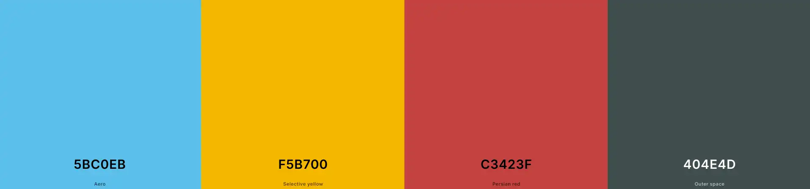
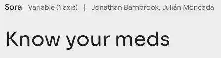

# Know your meds

View the deployed site: [Know your meds](https://github.com/keelam13/know-your-meds)

Test your knowledge on medications commonly prescribed for different ailments. This quiz is inspired by the creator's desire to know what the differrent medications are for.

Among the six rights for medication administration is the right medication. The healthcare professional must make sure the the client is receiving the right medication prescribed: medication label must be checked, name, dosage, and strength of the medication must be verified.

This multiple choice quiz will help players get familiarized with different kinds of drugs and will refresh their knowledge on drug mode of action, while having fun.

---

## CONTENTS

* [User Experience](#user-experience-ux)
  * [User Stories](#user-stories)

* [Design](#design)
  * [Colour Scheme](#colour-scheme)
  * [Typography](#typography)
  * [Imagery](#imagery)

  * [Wireframes](#wireframes)

* [Features](#features)
  * [General Features on Each Page](#general-features-on-each-page)
  * [Future Implementations](#future-implementations)
  * [Accessibility](#accessibility)

* [Technologies Used](#technologies-used)
  * [Languages Used](#languages-used)
  * [Other Technologies used](#other-technologies-used)

* [Deployment & Local Development](#deployment--local-development)
  * [Deployment](#deployment)
  * [Local Development](#local-development)
    * [How to Fork](#how-to-fork)
    * [How to Clone](#how-to-clone)

* [Testing](#testing)

* [Credits](#credits)
  * [Code Used](#code-used)
  * [Content](#content)
  * [Media](#media)
  * [Acknowledgments](#acknowledgments)

---

## User Experience (UX)

### User Stories

#### First Time Visitor Goals
* I want to take part of the quiz and improve my knowledge on medications.
* I want to ba able to take the quiz on different device screen-sizes.
* I want to easily navigate through the site.

#### Returning Visitor Goals
* 

#### Frequent Visitor Goals
* 

## Design

### Colour Scheme

The color palette was generated through the Coolors website.
* The color #f5b700 was used as the main background.
* The color #5bc0eb was used as the backgrounf of the alert box.
* The colors #c3423f and #404e4d in combination were used for in the result display.

### Typography

Font used for this site was imported from [Google Fonts](https://fonts.google.com/).

* Sora Google font was used as the primary font for the site for content readability.
  
### Imagery

Photo used for the site was taken from the web, which I included in the [Credits](#credits) section.

### Wireframes

#### Mobile devices
* Home display

* Quiz display

* Alert display

* Result display

#### Tablets
* Home display

* Quiz display

* Alert display

* Result display

#### Desktop
* Home display

* Quiz display

* Alert display

* Result display

## Features

### General features

The website only has a single page which is divided into three sections, which are accessible from the navigation menu (About us, Trails and Join us sections). A second page is also added as a response page which is shown once a user correctly fills out and submits the form on the Join Us section.

#### Hero Section

This section has a fixed background image which show a view of Mt. Pulag where the group climbs on a regular basis. It also contains a cover text with the tag Mt. Pulag is known for and the address.

* Hero section view on larger screens

* Hero section view on mobile devices

#### Footer

Both pages have a footer which contains a qoute from Edmund Hillary and social media icon links to facebook, instagram, youtube and tiktok. Icons were used to keep the footer clean and because they are universally recognisable. For users to be able to contact Mt. Pulag hikers, mobile phone numbers and email address are also shown alongside the social media icons. Icons are also animated on hover.

* Footer view on larger screens

* Footer view on mobile devices

### About us

The section is further broken down into subsectioned, which gives the user information about the group, what potential joiners should prepare, and the gallery which may attract users in joining. The images in the gallery are stacked horizontally which users can scroll to view.

* About us section view on larger devices

* About us section view on mobile devices

### Popular trails

This sections give the user information on popular trails when climbing Mt. Pulag. It contaions the name of the trail, difficulty, where the jump-off point is and for whom is it ideal for. It also contains a picture of the trail for the user to have an idea what to expect. A subsection is also higlighted with a blinking text and border to cath the attention of the user on a soon to open post.

* Popular trails section view on larger screens

* Popular trails section view on mobile devices

### Join Us

This section gives the user the opportunity to establish contact with, and to join the group. It has a form where users can enter their names and Email address for the group to get back to them. From the same form, users can also choose already which trail they prefer to take by clicking on a button. All inputs are also set as required so the fields must be filled out properly before submitting. The text input field is animated for largers screens when the pointer hovers over it. The submit button is also animated on hover. Once the submit button is clicked, it will lead to the response page.

* Join us section view on larger screens

* Join us section view on mobile devices

### Response page

A message welcoming the user to the team after submitting the form and lets them know someone will reach out to them within 24 hours. It also says that the user may now prepare for the climb. The page is set to be redirected to the home page in 10 seconds or users may click on the here link, or Back to home page on the navigation bar to go back to the home page.

* Response page view on larger screens

* Response page view on mobile devices

### Future Implementations

* Add some maps for the popular trails.
* Add link to the email address.
* Use images with better resolutions.
* Improve quaity of commit messages and commit every after bit of changes.
* Work on the website performances on mobile devices and desktops.
* Proper use of the flex box.

### Accessibility

I have been mindful during coding to ensure that the website is as accessible friendly as possible. I have achieved this by:

1. Using semantic HTML.
2. Using descriptive alt attributes on images on the site.
3. Providing information for screen readers where there are icons used and no text - e.g. social networks.
4. Ensuring that there is a sufficient colour contrast throughout the site.
5. Ensuring menus are accessible by fixing it on top of the screen.

## Technologies Used

### Languages Used

HTML and CSS were used to create this website.

### Other Technologies used

* [Balsamiq](https://balsamiq.com/) - Used to create wireframes.
* [Git](https://git-scm.com/) - For version control.
* [Github](https://github.com/) - To save and store the files for the website.
* [Google Fonts](https://fonts.google.com/) - To import the fonts used on the website.
* [Font Awesome](https://fontawesome.com/) - For the iconography on the website.
* [Google Dev Tools](https://developer.chrome.com/docs/devtools) - To troubleshoot and test features, solve issues with responsiveness and styling.
* [Tiny PNG](https://tinify.com/web/convert) To compress images.
* [Birme](https://www.birme.net/?target_width=500&target_height=300&no_resize=true&image_format=webp) To resize images and change to webp format.
* [Favicon.io](https://favicon.io/) To create favicon.
* [Am I Responsive?](https://ui.dev/amiresponsive) To show the website image on a range of devices.
* [Coolors](https://coolors.co/) was used to create the color palette.
* [EzGif](https://ezgif.com) was used to resize GIF images.
* [Design.com](https://www.design.com/) wasused to design the logo.

## Deployment & Local Development

### Deployment

The site is deployed using GitHub Pages - Mt. Pulag Hikers

To Deploy the site using GitHub Pages:
1. Login (or signup) to Github.
2. Go to the repository for this project, keelam13/mt-pulag-hikers
3. Click the settings button.
4. Select pages in the left hand navigation menu.
5. From the source dropdown select main branch and press save.
6. The site has now been deployed, please note that this process may take a few minutes before the site goes live.

The live link can be found [here](https://keelam13.github.io/know-your-meds/).

### Local Development

#### How to Fork

To fork the Know your meds repository:

1. Log in (or sign up) to Github.
2. Go to the repository for this project, keelam13/mt-pulag-hikers.
3. Click the Fork button in the top right corner.

#### How to Clone

To clone the Know your meds repository:

1. Log in (or sign up) to GitHub.
2. Go to the repository for this project, keelam13/mt-pulag-hikers.
3. Click on the code button, select whether you would like to clone with HTTPS, SSH or GitHub CLI and copy the link shown.
4. Open the terminal in your code editor and change the current working directory to the location you want to use for the cloned directory.
5. Type 'git clone' into the terminal and then paste the link you copied in step 3. Press enter.

## Testing

Please refer to the [TESTING.md](TESTING.md) file for all test-related documentation.

## Credits

### Code Used

* [Image gallery with horizontal scroll]()
* [Fading image]()
* [Blink animation]()
* [Refresh page metadata]()

### Content

The inspiration for the content came from the increasing number of hikers and tourists alike who want to climb Mt. Pulag.  

###  Media

Some of the images images used on the website are personal collection, and the other were taken from different bloggers who went to Mt. Pulag.

  
###  Acknowledgments

- The Almighty for the opportunity to do coding.
- My family for their unending support.
- My other half for the love and understanding.
- Cici my girl for the inspiration.
- [Iuliia Konovalova](https://github.com/IuliiaKonovalova) my mentor for the advice, tips and guiding me through the project.
- [Kera Cudmore](https://github.com/kera-cudmore) for the great help on constructing a README file.
- [Code Institute](https://codeinstitute.net/) lessons, tutors and Slack community members for their support and help.
- [Kevin Powell](https://www.youtube.com/user/KepowOb) for his amazing CSS tutorials.
