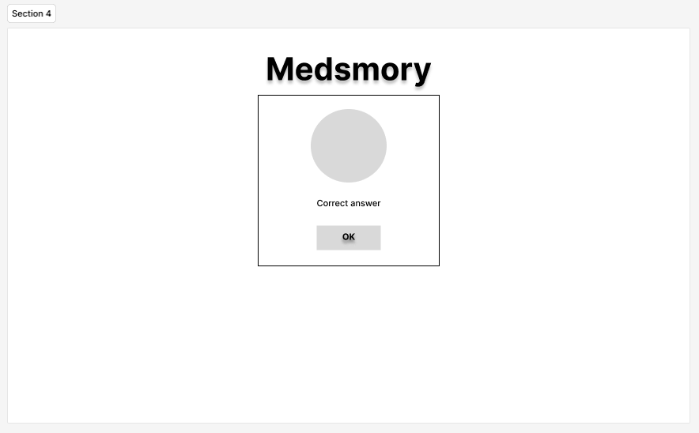

View the deployed site: [Medsmory](https://github.com/keelam13/Medsmory)

Test your knowledge on medications commonly prescribed for different ailments. This quiz is inspired by the creator's desire to know what the differrent medications are for.

Among the six rights for medication administration is the right medication. The healthcare professional must make sure the the client is receiving the right medication prescribed: medication label must be checked, name, dosage, and strength of the medication must be verified.

This multiple choice quiz will help players get familiarized with different kinds of drugs and will refresh their knowledge on drug mechanism of action, while having fun.

---

## User Experience (UX)

### User Stories

#### First Time Visitor Goals
* I want to take part of the quiz and improve my knowledge on medications.
* I want to ba able to take the quiz on different device screen-sizes.
* I want to easily navigate through the site.

#### Returning Visitor Goals
* I want to be able to choose other category to play.

## Design

### Colour Scheme

The color palette was generated through the Coolors website.
* The color #f5b700 was used as the main background.
* The color #5bc0eb was used as the background of the alert box.
* The colors #c3423f and #404e4d in combination were used in the result display.

### Typography

Font used for this site was imported from [Google Fonts](https://fonts.google.com/).

* Sora Google font was used as the primary font for the site for content readability.
  
### Imagery

Photo used for the site was taken from the web, which I included in the [Credits](#credits) section.

### Wireframes

#### Mobile devices
* Home display

* Category display

* Quiz display

* Alert display

* Result display

#### Tablets & Desktops
* Home display

* Category display

* Quiz display

* Alert display

* Result display

### Workflow

How the game works was planned using the this workflow made with [Miro](http.miro.com)

## Features

### General features

The website only has a single page which displays the different sections during navigation. These are the home display, category display, quiz display, alert display and the result display. Inside the page is also a section for confirmation when the player clicks the close/quit button. The site has a fixed background for consistency. The site is also responsive to a range of device screens.

* The page has a favicon in the browser tab.

* The page displays every section with the game logo.

#### Home Display

This section contains the instruction on how to play and a "Start" button, which initiates the quiz.

* Home section view on larger screens

* Home section view on mobile devices

#### Category Display

Before taking the quiz, player will be asked to choose from 2 categories.

* Category section view on larger screens

* Category section view on mobile devices

#### Quiz Display

It displays the question number, the question and the buttons with options. Player can select an answer by clicking on the button containing the desired answer. Below is a "Submit" button to confirm the selected answer. The selected answer will then be checked. On the upper right corner is a close button which brings the player back to home display.

* Quiz view on larger screens

* Quiz view on mobile devices

### Quit Confirmation Display

Player will be asked to confirm if they really want to quit the game.

* Quit confirmation view on larger screens

* Quit confirmation view on mobile devices

### Alert Display

The display is a way to tell the player whether the answer was correct or not. It will show a tick icon in color green, if the answer is correct, and otherwise it will show a x icon in red color. It also contains the correct answer to the question. The box also contains an "OK" button to acknowledge the alert and move on to the next question.

* Alert display view for correct answer on larger devices

* Alert display view for incorrect answer on larger devices

* Alert display view for correct answer on mobile devices

* Alert display view for incorrect answer on mobile devices

### Result Display

The game ends by showing how well the player did on the quiz. Each correct answer will be counted during the game and will be displayed over the number of questions on the result section. Under the score are two buttons: The "Play again" button which lets the player to retake the quiz, and the "Exit game" button which brings player back to home display.   

* Result Display view on larger screens

* Result Display view on mobile devices

### Future Implementations

* Categorize the questions by specific drug class (eg. anti-hypertensives , anti-diabetics, etc). 
* Add level of difficulty or more categories.
* Allow players to save their scores and show high scores.
* Functionality of keyboard in the quiz, like keydown listeners.
* Improve quality of commit messages and commit every after bit of changes.

### Accessibility

I have been mindful during coding to ensure that the website is as accessible friendly as possible. I have achieved this by:

1. Using semantic HTML.
2. Using descriptive alt attributes on images on the site.
3. Providing information for screen readers where there are icons used and no text.
4. Ensuring that there is a sufficient colour contrast throughout the site.
5. Using hover state on all buttons for player to see which buttons they are hovering over.

## Technologies Used

### Languages Used

HTML, CSS and JavaScript were used to create this website.

### Other Technologies used

* [Miro](https://miro.com) - Used to create the workflow.
* [Git](https://git-scm.com/) - For version control.
* [Github](https://github.com/) - To save and store the files for the website.
* [Github Pages](https://pages.github.com/) - To deploy the website.
* [Google Fonts](https://fonts.google.com/) - To import the fonts used on the website.
* [Font Awesome](https://fontawesome.com/) - For the iconography on the website.
* [Google Dev Tools](https://developer.chrome.com/docs/devtools) - To troubleshoot and test features, solve issues with responsiveness and styling.
* [Design.com](https://www.design.com/) To create a logo.
* [Birme](https://www.birme.net/?target_width=500&target_height=300&no_resize=true&image_format=webp) To resize images and change to webp format.
* [Favicon.io](https://favicon.io/) To create favicon.
* [Am I Responsive?](https://ui.dev/amiresponsive) To show the website image on a range of devices.
* [Coolors](https://coolors.co/) was used to create the color palette.
* [Removebg](https://www.remove.bg/) was used to remove backgrounds from images.
* [Figma](https://www.figma.com) was used to make the wireframes.
* [Ezgif](https://ezgif.com/) was used to convert videos to GIFs.

## Deployment & Local Development

### Deployment

The site is deployed using GitHub Pages - [Medsmory](https://keelam13.github.io/Medsmory/)

To Deploy the site using GitHub Pages:
1. Login (or signup) to Github.
2. Go to the repository for this project, keelam13/Medsmory
3. Click the settings button.
4. Select pages in the left hand navigation menu.
5. From the source dropdown select main branch and press save.
6. The site has now been deployed, please note that this process may take a few minutes before the site goes live.

### Local Development

#### How to Fork

To fork the Medsmory repository:

1. Log in (or sign up) to Github.
2. Go to the repository for this project, keelam13/Medsmory.
3. Click the Fork button in the top right corner.

#### How to Clone

To clone the Medsmory repository:

1. Log in (or sign up) to GitHub.
2. Go to the repository for this project, keelam13/Medsmory.
3. Click on the code button, select whether you would like to clone with HTTPS, SSH or GitHub CLI and copy the link shown.
4. Open the terminal in your code editor and change the current working directory to the location you want to use for the cloned directory.
5. Type 'git clone' into the terminal and then paste the link you copied in step 3. Press enter.

## Testing

Please refer to the [TESTING.md](TESTING.md) file for all test-related documentation.

## Credits

### Code Used

* [Simple Steps Code](https://simplestepscode.com/javascript-quiz-tutorial/), [Medium](https://medium.com/@codepicker57/building-an-interactive-quiz-with-html-css-and-javascript-efe9bd8129e2) and [Web Dev Simplified](https://www.youtube.com/watch?v=riDzcEQbX6k) greatly inspired the building of this project.
* [Overlay](https://stackoverflow.com/a/26409701) - inspired the creation of an overlay to disable the background of the alert or confirmation displays.
* [Detect which of two buttons is called](https://stackoverflow.com/a/47175277) - inspired a better coding on how to choose multiple elements, which is in this case buttons. 
* [Shuffle Questions](https://github.com/IuliiaKonovalova) code shared during one of our mentor meetings, helped in shuffling questions.
* [Shuffle options](https://www.youtube.com/watch?v=riDzcEQbX6k) - from the video tutorial of [Web Dev Simplified](https://www.youtube.com/@WebDevSimplified) used to shuffle options.

### Content

The content of the quiz, specifically the questions and drugs with their brand names are sourced out from different sites as follows:

* [The European Medicines Agency](https://www.ema.europa.eu)
* [Drugs.com](https://www.drugs.com/)
* [Drug Bank](https://go.drugbank.com/)
* [Mayo Clinic](https://www.mayoclinic.org/)
* [Merck | Germany](https://www.sigmaaldrich.com/DE/de)
* [Inxight Drugs](https://drugs.ncats.io/)
* [Wikipedia](https://en.wikipedia.org) 

###  Media

The images used in the site were taken from other sites.

* [The Medsmory Logo](https://www.design.com/)
* [The check and x icons](https://www.freepik.com/)
* [The ? pills](https://www.nationalelfservice.net/mental-health/depression/childhood-psychopathology-can-predict-antidepressant-use-in-young-adults/attachment/shutterstock_64158991-question-mark-pills-tablets/)
* [The prescription pad and pill](https://www.flaticon.com/free-icon/prescription_4383660)
  
###  Acknowledgements

- The Almighty for the opportunity to do coding.
- My family for their unending support.
- My other half for the love and understanding.
- Cici my girl for the inspiration.
- [Iuliia Konovalova](https://github.com/IuliiaKonovalova) my mentor for the advice, tips and guiding me through the project.
- [Kera Cudmore](https://github.com/kera-cudmore) for the great help on constructing a README file.
- [Code Institute](https://codeinstitute.net/) lessons, tutors and Slack community members for their support and help.
- [Kevin Powell](https://www.youtube.com/user/KepowOb) for his amazing CSS tutorials.
- [Web Dev Simplified](https://www.youtube.com/watch?v=riDzcEQbX6k) for a great tutorial video on building a quiz with javascript.
- [Slack overflow](https://stackoverflow.com/) and [MDN Web Docs](https://developer.mozilla.org/en-US/) for being my run-to references when I have questions. 
