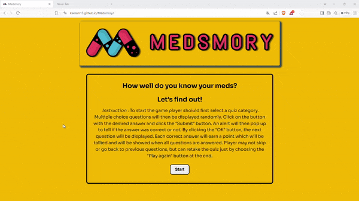
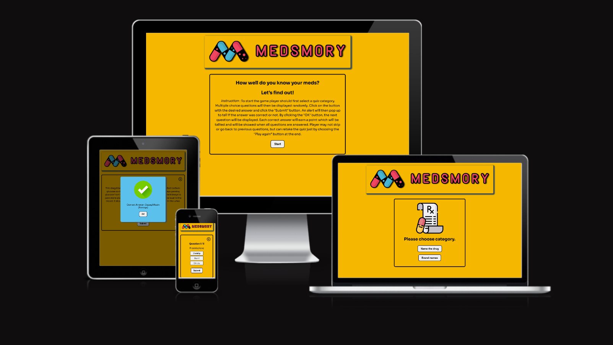
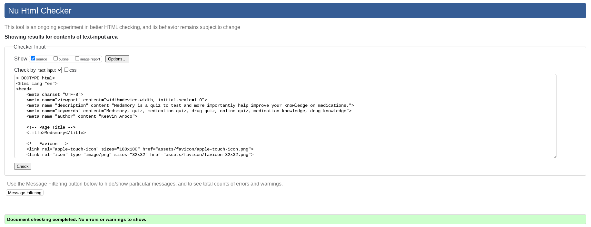
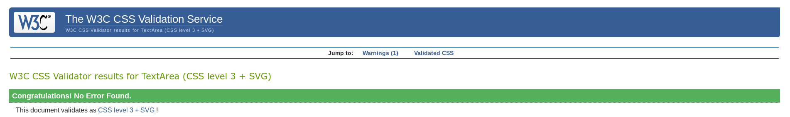
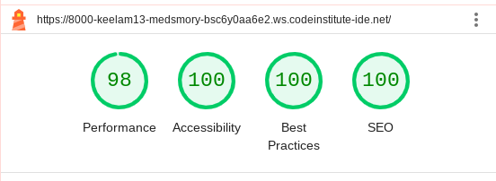
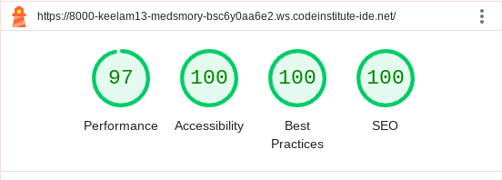

# TESTING

## Compatibility

The webpage was built using Chrome browser, but in order to confirm the correct functionality, responsiveness, and appearance:

+ The website was also tested on the following browsers: Edge, Firefox, Brave.

    - Chrome:

    

    - FireFox

    

    - Brave:

    

## Responsiveness

Aside from testing the website of its responsiveness using the dev tools, the [Am I responsive?](https://ui.dev/amiresponsive) was also used to check how the website respond on different screen sizes.

## Manual testing

+ The functionality of the links in the website was checked as well by different users.

| Feature | Action | Expected Result | Tested | Passed | Comments |
| --- | --- | --- | --- | --- | --- |
| Home Page | | | | | |
| Start Button | Click on the button | The user is redirected to choose category. | Yes | Yes | - |
| Category Display | | | | | |
| Name the drug category Button| Click on the button | The quiz describing a drug which will be identified will be displayed. | Yes | Yes | - |
| Brand names category Button | Click on the button | The quiz showing drugs to be identified which of the brand names will be displayed. | Yes | Yes | - |
| Quiz Display | | | | | |
| Close/Quit Button | Click on the button | The user will be asked to confirm quiting the game. | Yes | Yes | - |
| Options Buttons | Click on a button | The answer will be selected | Yes | Yes | - |
| Submit Button | Click on the button | The selected answer will check the answer if it is correct or not and will alert the user. | Yes | Yes | - |
| Alert Display | | | | | |
| OK Button | Click on the button | The user is redirected to the quiz if there are more questions. If not the user will be redirected to the result page. | Yes | Yes | - |
| Result Display | | | | | |
| Play again Button | Click on the button | The user will be redirected to a new quiz. | Yes | Yes | - |
| Exit game Button | Click on the button | The user will be redirected to the home page. | Yes | Yes | - |
| Confirm Display | | | | | |
| Yes Button | Click on the button | The user is redirected to the home page | Yes | Yes | - |
| No Button | Click on the button | The user is redirected back to the quiz. | Yes | Yes | - |

## Testing User Stories

* First Time Visitors
  * I want to take part of the quiz and improve my knowledge on medications.
    - The quiz contents are specifically about medications and are pulled from reliable  sources and are based on studies. This quiz is available to users whenever, whereever.
  * I want to ba able to take the quiz on different device screen-sizes.
    - The quiz is built to respond to a wide range of device screen sizes.
  * I want to easily navigate through the site.
    - The quiz uses buttons all thoughout for easy navigation.

* Returning Visitors
  * I want to be able to choose other category to play.
    - Users are able to select from 2 categories.

---

## Validator testing
+ ### HTML
  #### Home Page
    - No errors or warnings were found when passing through the official W3C validator.

    
    
+ ### CSS
  No errors or warning were found when passing through the official W3C (Jigsaw) validator:
    
    

+ ### JavaScript
  No errors or warning were found when passing through the official jshint validator:
    
    

+ ## LightHouse report

    - Using lighthouse in devtools, the performance, the accessibility and the readability of the website were checked.
    
  ### Home page

    - Home page on desktop 

  

    - Home page on mobile

  

---
​
## Bugs

+ ### Solved bugs

    1. The overlay was not covering the whole screen when an alert or confirmation pops up, and the buttons on the background can be clicked and cause error.
      *Solution:* The position style of the ovarlay was set to fixed.

    2. The displayed score does not reset to zero.
      *Solution:* The function to increase the scrore and to display score in the result page was removed and the two were separated. The score increment code was placed under the if function and the display of score under the show result function.

    3. The Favicon does not appear on the browser tab.
      *Solution:* The forward slash which was accidentally typed before the filepath of the Favicon was deleted. 

+ ### Unsolved bugs

    - 

+ ### Mistakes
    - Mistakes in some commited messages.

---
  